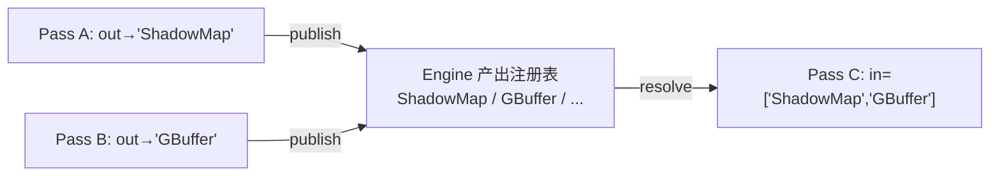

# Graphics 多 Pass 渲染管线设计

> 状态：已对齐代码（2026-09-03），v1 已落地
>
> ⚠ 2026-09-03 **Design B 变更**（下述 v1 描述的部分已过时）：RenderEngine 已**删除主通道**
> （`main_pass_`/`setMainPass`/`mainPass` 均移除），改为**空启动 + 显式注册**：引擎不再自动建
> scene/camera/pass；`scene()` 是可选的“默认内容”（未绑 content 的 pass 回落它，可 null），
> `masterCamera()` 是可选的交互主相机（manipulator 驱动它，不设则无效）。“窗口 pass”就是
> camera==masterCamera 且 RT==null 的注册 pass（约定 order 0）。全部 pass 进统一 `passes_`
> 注册表按 order 升序执行 + overlays 最后，无锚点特判。默认 viewer 由 fw 层 RenderControl
> 引导（passCount()==0 时注册默认窗口 pass）。本文件下方 v1 章节保留作设计演进记录。
>
> 定位：`RenderEngine` 多 Pass 调度、pass↔场景内容关联、pass 间数据衔接的**设计基线**；
> 后续新增光源 / 阴影 / 后处理均以此为扩展点。

## 0. 一句话模型

> **Pass = 「输入 → 输出」的一个可执行单元；Scene 只是“数据生产者”之一；
> 真正在 pass 之间流动的“货币”是 RenderTarget 的纹理附件；衔接（连接关系）由
> RenderEngine 统一管理。**

## 1. 术语与职责切分

| 概念 | 定义 | 归属 |
|---|---|---|
| **RenderPass** | 通道定义（stage）：怎么画 + 画到哪 | 无内容、可复用模板 |
| **内容(Scene)** | 画什么（世界数据，含将来的光源） | **Engine** 关联管理 |
| **视图(Camera/VP)** | 怎么取景（与 target 宽高比绑定） | Pass（借用，共享外部保活） |
| **输出(RenderTarget/FBO)** | 画到哪（通道的输出资源） | Pass（**持有**，null=backbuffer） |
| **调度槽(PassSlot)** | 一次执行：pass + 可选内容 + order | **Engine** 持有 |
| **衔接/依赖** | 谁写谁读、先后关系 | **Engine**（order + 将来的依赖图） |

### 数据生产者分类

| 类型 | 数据源 | 需要 | 例子 |
|---|---|---|---|
| **Scene pass** | 遍历场景几何/材质 | 视图(Camera→VP) | main forward、shadow map、g-buffer、depth prepass、镜像 |
| **Screen pass（将来）** | 前序 pass 输出的纹理 | 全屏三角形 + 采样 | 后处理、合成、模糊 |

Scene pass 之间“画同一份场景、各用自己的 view/target/order”；Screen pass 与场景解耦，
消费纹理附件。

## 2. RenderEngine 调度（已落地 v1）

一帧执行序（以主通道 order 0 为锚）：

```
beginFrame
  pre passes (order < 0)          // shadow / depth / g-buffer
  main pass  (order 0, 引擎场景)   // 内容固定 = engine.scene_
  post passes (order > 0)         // 后处理 / 合成
  overlays (升序 zOrder)          // HUD，永远最顶层
endFrame; swapBuffers
```

- 同 `order` 内按 `addPass()` 插入顺序**稳定**执行。
- **内容关联由 Engine 管理**：每个槽 `{ pass, content(可空), order }`，执行时解析
  `effectiveContent = slot.content ?: engine.scene_`。
- 收益：`setScene()` 对未绑定通道是**单点更新**；`RenderPass` 保持无内容、可复用；
  应用只通过 Engine API 组装。

### 公开 API（v1）

```cpp
// ---- 内容（默认内容，所有未绑定通道绘制它）----
void setScene(intrusive_ptr<Scene> scene);
raw_ptr<Scene> scene() const;

// ---- 场景通道管线 ----
void addPass(intrusive_ptr<RenderPass> pass, int order);                       // 画引擎场景
void addPass(intrusive_ptr<RenderPass> pass, intrusive_ptr<Scene> content, int order); // 画显式场景
void bindPassContent(raw_ptr<RenderPass> pass, intrusive_ptr<Scene> content);  // 重绑；null=回落引擎场景
raw_ptr<Scene> contentOf(raw_ptr<RenderPass> pass) const;                      // 有效内容
void removePass(raw_ptr<RenderPass> pass);
void clearPasses();
std::size_t passCount() const;

// ---- 主通道（锚点）----
void setMainPass(intrusive_ptr<RenderPass> pass);
raw_ptr<RenderPass> mainPass() const;
```

### RenderPass 定义（已落地 v1）

```cpp
// view：借用（raw_ptr<Camera>）——共享视图，外部保活（如引擎主相机）
void setCamera(raw_ptr<Camera> camera);

// 输出：持有（intrusive_ptr<RenderTarget>）——通道的输出资源自保活
void setRenderTarget(intrusive_ptr<RenderTarget> target);   // null = backbuffer
raw_ptr<RenderTarget> renderTarget() const;

// clear / viewport 仍是通道状态
void setClearColor(const Color&);  void setShouldClearDepth(bool);
void setClearEnabled(bool);        void setViewport(x,y,w,h); ...

void execute(raw_ptr<Scene> scene, raw_ptr<RenderBackend> backend);
```

> 注：析构在 `.cpp` 出外联（持有不完整类型 `RenderTarget` 成员所需）。

## 3. 为什么顺序必须显式且确定

渲染正确性本身依赖先后，这不是性能问题而是正确性问题：

| 阶段 | 例子 | 原因 |
|---|---|---|
| `order < 0` | shadow map、depth/g-buffer | 必须在被照亮的几何体之前 |
| `order 0` | main（forward/deferred 光照） | 锚点 |
| `order > 0` | 后处理 / 合成 | 必须在着色之后 |
| overlays | HUD | 覆盖最上层 |

同一 target 上连续 pass 的 clear/混合/深度策略同样由顺序决定（谁先写、谁不清屏保 depth）。

## 4. FBO 拓扑（RenderTarget 是否同一个）

- **FBO 是 per-pass 的输出**；是否共享取决于“该小段通道是否需要共享缓冲”。
- 三种典型形态：
  1. **共享同一 FBO/depth（前向小步拆分）**：depth prepass 与 main 共享同一 depth 附件；
     main 关 depth-write、开 depth test（equal）。共享方式 = 两个 pass 各自持有同一个
     `RenderTarget` 的引用（RefCounted 天然共享）。
  2. **各自独立 FBO（不同阶段）**：shadow map（depth-only）、g-buffer（MRT）、光照输出、
     后处理（ping-pong 两张）。
  3. **主场景 = backbuffer**：`renderTarget()==nullptr`，只有它需要 swap。
- 规则：引擎不拥有 FBO，只保证执行序；共享 FBO 的 clear/load-store 由 pass 的 clear 策略显式表达；
  **禁止 feedback**（一个 pass 不能同时读写同一张纹理 → 后处理用 ping-pong）。

## 5. 不同 pass 的数据衔接与传递

### 两种依赖

- **顺序依赖**：谁先跑（v1 显式 `order`；将来可自动推导）。
- **数据依赖**：谁把什么交给谁（“衔接”的本质）。

### 四种数据载体

| 载体 | 传什么 | 阶段 |
|---|---|---|
| **A. 输出纹理** | A 写 RT 的 color/depth → B 采样 | 将来（Screen pass 输入槽） |
| **B. 共享附件** | 两 pass 共用同一 target/depth | 现在（各自持有同一 RT 引用） |
| **C. FrameContext** | dt、当前/上一帧 VP、光源、尺寸 | 骨架（随需扩展） |
| **D. RenderCommand** | pass 内部收集的 CPU 命令 | 现在（现状） |

### 推荐衔接模型（为自动帧图留门）

不做“pass 之间互相握 target 指针”，而是 **Engine 侧“命名产出注册表（publish/resolve）”**：



- 解耦：消费者只声明“我要一个叫 X 的纹理”，不关心生产者。
- 可复用：同一段后处理对主场景颜色 / 小地图颜色都成立。
- 顺序可推导：Engine 从 “P3 需要 X” 即可推断写 X 者必须先于 P3（将来替代手写 order）。

### 一帧衔接时序（目标态）

```
beginFrame()
  for pass in 管线(按序):
    1. 解析内容：slot.content ?: engine.scene_
    2. 视图：用 pass 的 Camera（aspect 匹配 pass 输出 target 尺寸）
    3. 绑定输出：backend->setRenderTarget(pass 输出 RT / null=backbuffer)
    4. 解析输入：pass 声明的输入槽 → 绑定纹理（查注册表）
    5. load/store：按 pass clear 策略（共享 FBO 不清屏/保 depth）
    6. 收集命令并渲染（遍历内容场景 → RenderCommand → backend->render）
    7. publish：登记本 pass 输出（供后续 resolve）
  overlays(升序)
endFrame(); swapBuffers()
```

## 6. 相机与 VP（per-pass，非全局）

| pass | 相机 | VP |
|---|---|---|
| main + 它的 depth prepass | 复用同一 Camera | 相同（共享一份） |
| shadow / 反射 / 小地图 | 独立 Camera | 不同 |
| 全屏后处理（将来） | 不需要 | 用不到 |

- **相机 aspect 必须匹配该 pass 的 target 尺寸**：把主相机复用到不同宽高比的离屏 target 会变形；
  要么给该 pass 独立相机，要么按 target 尺寸重设投影。因此“复用相机”只应发生在尺寸一致的 pass 间。
- Camera 是 `RefCounted` 资源，pass 以 `raw_ptr` 借用，生命周期由创建者/引擎主相机保活。

## 7. 落地分期

| 阶段 | 范围 | 状态 |
|---|---|---|
| **v1（现在）** | 有序场景通道管线 + Engine 内容关联 + RenderPass 持有输出 target | ✅ 已实现 |
| **v2** | RenderTarget 离屏能力 + RenderBackend 离屏契约（**平台层已落地**）；`FrameContext` 与 vsg 离屏 render-to-texture 待 GPU 上迭代 | 平台层 ✅，vsg 待做 |
| **v3** | Screen/全屏 pass + “命名产出槽” publish/resolve 衔接 | ✅ 已实现（2026-09-03） |
| **v4** | 光源系统（挂 Scene）+ shadow map（光源相机 order<0 通道） | 待做 |
| **v5（可选）** | 自动依赖排序/帧图、后处理链 | 待做 |

## 8. 与未来光源系统的衔接

- 光源计划挂在 `Scene` 上；Engine 已解析出每个 pass 的“有效内容(Scene)”，光源列表随场景走。
- shadow map = “同一份场景 + 光源相机 + depth-only RenderTarget”的 `order<0` 通道 ——
  复用 v1 的调度，无需改 `RenderPass` 定义。
- 延迟光照（v3/v4）：g-buffer（MRT）→ 光照 pass 经“命名产出槽”读 g-buffer → 后处理。

## 9. 关键决策记录

1. Scene **不放**在 `RenderPass` 上（破坏复用/换场景同步/全屏 pass 无场景）→ 由 **Engine** 关联管理。
2. 相机放 pass（借用）；输出 RenderTarget 放 pass（持有）；null target = backbuffer。
3. 顺序以 int `order` 升序 + 稳定插入，主通道锚 0；overlays 永远最后。
4. 数据传递以“纹理附件 + FrameContext”为主；衔接按“命名产出槽”解耦，为自动排序留门。
5. 分期避免过度设计：当前只做“顺序 + 各自输出 target + 内容关联”，Screen pass/输入槽后置。

## 10. RenderBackend / vsg 后端演进设计（v2/v3）

> 结论先行：**抽象 `RenderBackend` 不推翻重设计** —— 多 pass 调度在 CPU
> （RenderEngine/RenderPass）；后端只需**增量补离屏与纹理能力**。
> **vsg 后端要中等重构**：从“单主 RenderGraph + overlay 特判”演进为“一帧内按
> pass 提交多个 RenderGraph（每个输出 target 一个）”。

### 10.1 设计原则

- 后端 = 低层“设备”抽象（绑定目标 / 视口 / clear / 提交命令 / 交换缓冲），与 pass 无关；
  RenderPass::execute 已把多 pass 编排成其上的命令序列，无需后端“认识 pass”。
- 逐 pass 的“输入→输出”数据流属于 CPU 调度层；后端只负责“当前输出 target + load/store +
  采样输入能绑到哪”。

### 10.2 抽象接口的增量演进（非破坏）

| 能力 | 现状 | v2 增量 | v3 增量 |
|---|---|---|---|
| **离屏 FBO** | `setRenderTarget(RenderTarget*)` 仅支持 null=backbuffer | 后端为 `RenderTarget` 创建真实 color/depth 附件并绑定（render-to-texture） | MRT（多 color 附件） |
| **load/store** | 仅 clear 开关 | 每个 pass 表达 load/store（vsg→`loadOp LOAD/CLEAR`） | 同左 |
| **采样输入** | 无 | —（v2 仅“写离屏 + 回拷/合成”） | 把某 RT 纹理作为后续 pass 输入（Screen pass） |
| **提交收敛** | 散命令序列 + 遗留 `executePass(pass, commands)` 未用 | 可把 RenderPass::execute 改为“一次提交一个 pass 描述（target + load/store + viewport + camera + commands）”，后端内部组 RenderGraph/处理 barrier | 同左 |
| **FrameContext** | 无 | 每帧共享上下文（dt/VP 历史/尺寸/光源）传后端/命令 | 同左 |

> v2 只承诺“能渲染到离屏 target 并把内容呈现/拷回屏幕”，验证多 target 与 load/store；
> 真正的“A 的产物被 B 采样”（后处理/阴影采样）放 v3（需要材质/全屏管线带纹理能力）。

### 10.3 RenderTarget 的生命周期设计

- `RenderTarget`（graphics SDK）= 平台无关的**逻辑帧缓冲描述**：size + color/depth 格式 + 附件标志
  （现已有雏形）。
- 真正的 GPU 附件由**后端**持有缓存：`backend:: map<RenderTarget*, BackendFBO{color/depth 纹理}>`，
  惰性创建、按需重建（resize）。
- 供后续 pass 采样时，后端把该 target 的 color/depth 纹理作为**采样资源**暴露（平台无关的
  最小接口，v3 引入；vsg 侧即 `vsg::ImageView`）。
- 生命周期：target 由应用创建并持有；GPU 资源随后端（`shutdown()` 时释放）或在 target 不再
  被任何 pass 引用后由后端惰性清理。

### 10.4 vsg 后端映射

| 抽象概念 | vsg 实现 |
|---|---|
| 输出 target | 每个非空 RenderTarget → 一组 `vsg::Image(+DepthImage)` + 独立 `vsg::RenderGraph`；null → 现有窗口 RenderGraph |
| load/store | RenderGraph 的 `loadOp`/`storeOp`（LOAD=不清屏叠层，CLEAR=按 pass clear 策略） |
| depth-only（shadow 预备） | 仅 depth 附件的 RenderGraph + 光源相机 |
| 采样输入（v3） | RT 的 `vsg::ImageView` 作为后续 pass 的 ImageDescriptor |
| 提交 | `vsg::Viewer::recordAndSubmit` 提交“本帧所有 pass 的 RenderGraph 集合” |
| 现状差距 | ~~“单主图 + overlay_slots(Camera* 特判)”~~ 已于 2026-09 统一为 `window_layers`（Camera* 键，
  每层自带 View/SceneBridge/light_group/on_top）；SceneBridge 底座可复用，离屏/pass 每帧提交演进仍在
  §10.5 排期 |

### 10.5 演进顺序与验收

1. **v2a**：抽象层补“RenderTarget 由后端创建附件”的约定；vsg 实现 `setRenderTarget(RT)` +
   一个“离屏 pass 渲主场景到 RT，再拷回屏幕/合成到 backbuffer”的验证（证明多 target + load/store）。
2. **v2b**：把 `RenderPass::execute` 收敛为“按 pass 提交”（可用 `executePass`），帧上下文骨架。
3. **v3**：Screen/全屏 pass + “命名产出槽” publish/resolve + 采样输入（材质/管线带纹理）→ 首个后处理/阴影。
4. 验收标准：`GraphicsTest` 覆盖离屏多 pass 命令序列；vsg 端手动/自动验证“渲染到离屏→合成上屏”无
   barrier/loadOp 伪影；单 target 路径（现行为）回归不变。

### 10.7 落地记录（2026-09-03）

- **v2a 平台层已落地**：`RenderTarget` 增加 `hasColor()/hasDepth()/colorFormat()/depthFormat()/valid()`
  （离屏描述访问器，含单元测试）；`RenderBackend` 增加 `supportsRenderTargets()` 与离屏契约文档
  （非空 target = 后端自建 GPU 附件并绑定）。`RenderPass::execute` 本就把 target 传给后端，CPU 侧无需改。
- **vsg 离屏 scaffold 已实现（编译通过，GPU 未验证）**：`VsgRenderer` 现对非空 target 建立离屏
  color(±depth) `Image/ImageView` + `createRenderPass`/`Framebuffer` + 独立 `RenderGraph`（含自己的
  相机与 SceneBridge 保留根），命令经 `renderOffscreenTarget()` 同步；`supportsRenderTargets()==true`。
  默认（窗口）路径不变；首次 on-device 需验证 loadOp/管线兼容/后续采样与合成（采样属 v3）。
- **v2b（2026-09-03）**：新增 `FrameContext` 骨架（dt / 表面尺寸，由 `RenderEngine::frame()` 与
  `pushEvent(ResizeEvent)` 填充，经 `frameContext()` 暴露）；vsg 离屏在 target resize 时
  `deviceWaitIdle` + 从 `CommandGraph::children` 摘除旧图后重建；`app_shell` 增加
  `VINE_VSG_OFFSCREEN=1` 离屏验证入口（默认关闭，渲 640x360 RGBA8+D24 的 order<0 通道）。
- **首次 on-device 验证修复（2026-09-03，llvmpipe）**：① 离屏 `Image`/`ImageView` 必须先
  `vsg::createImageView(device,...)`（内部 compile Image + allocateAndBindMemory + compile
  ImageView），否则 VkImage/VkImageView 为 VK_NULL_HANDLE → 录制时 `vkCmdBeginRenderPass` 崩；
  ② 离屏 target 必须持有**独立 SceneBridge**（overlay 同款模式）：vsg 的 GraphicsPipeline 按
  viewID 逐视图编译，复用主场景 bridge 会把只按主视图 viewID 编译的 pipeline 挂到离屏视图下 →
  `GraphicsPipeline::vk(viewID)` 越界崩。resize 重建改为原地字段重置+清 bridge 缓存。
- **v3（2026-09-03）已实现（lavapipe 实测）**：
  - SDK：`RenderPass` 增 `setOutputName/addInputName` + `resolveInputTextures` + `execute` 改 virtual；
    新增 `ScreenPass`（默认不清屏，execute 设 target/viewport/clear 后调 `backend->drawScreenTexture`）；
    `RenderBackend` 增 `drawScreenTexture(RenderTarget*)`（默认 no-op）。
  - Engine：私有 `outputs_` 命名产出注册表（public `publish/resolve/unpublish`），每帧帧首清空，
    逐 pass “执行前 resolve 输入 → 执行后 publish 输出”。
  - vsg：`makeSampleableRenderPass`（color finalLayout=SHADER_READ_ONLY + subpass→external
    fragment-read 依赖，替代默认 PRESENT_SRC_KHR）；离屏 RenderGraph **插入 command_graph 队首**
    先于主图录制；`drawScreenTexture` 用内嵌 GLSL（ShaderCompiler，VSG_SUPPORTS_ShaderCompiler=1）
    建全屏纹理三角，作为主 render_graph 的第二个 View（复用 overlay 子视口机制）画 PiP；请求的
    rect 超出表面时自动收缩锚到右下。
  - 教训：vsg ShaderCompiler 逐模块编译后链接，**顶点输出/片元输入接口变量必须同名**（glslang
    报 “Input has no corresponding output”）；新增的 PiP View 若 `viewer->compile()` 失败必须从
    render_graph 摘掉再丢弃，否则录制已编译失败的 pipeline 会 `GraphicsPipeline::vk()` 崩。
  - 验证：`VINE_VSG_OFFSCREEN=1` 下离屏 640x360 渲主场景 → publish “SceneColor”→ ScreenPass
    PiP（右下 189x106）采样上屏，画面正确（离屏偏暗因仅环境光、无 headlight）；GraphicsTest 68 全过
    （新增 RenderPassTest 命名槽、Engine resolve/publish、离屏→Screen 链路 5 用例）。

### 10.6 关键决策

1. RenderTarget 的 GPU 附件归**后端**持有缓存，CPU 侧只保留逻辑描述（避免平台类型泄漏进 SDK）。
2. 输入采样接口 v3 再加（避免 v2 就设计死的采样 API）；v2 用“离屏 + 回拷/合成”先打通多 target。
3. vsg 从“单图 + HUD 特判”收敛为“每 pass 一图”是**中等重构**，但 SceneBridge 保留图底座复用，
   风险集中在 loadOp/提交/设备复用，按 v2a→v2b 小步验收。

## 11. 演进项（待多 pass 成熟）：pass 执行上下文 PassContext

> 状态：**设计就绪，暂缓实施**（2026-09-03）。与“shadow 排到最后”一致：待自定义 shader
> （buildVineShaderSet P0/P1）与多 pass/pipeline 模型完全成熟时，作为“多 pass 成熟”的一部分实施。

### 11.1 动机（现状的“味道”，非 bug）

现状 `virtual void execute(raw_ptr<Scene> scene, raw_ptr<RenderBackend> backend)` 的问题：

1. `scene` 对 `ScreenPass` 是**假参数**（被忽略）；“pass 自决”只是隐式约定，不在签名/契约上显式。
2. 引擎存在**隐式两阶段协议**：先 `resolvePassInputs()`（按 inputNames 查注册表 →
   `resolveInputTextures()` 把输入塞进 pass）再 `execute()`。`ScreenPass` 依赖“执行前输入已 resolve”，
   但签名表达不出这个先后依赖。
3. `execute(scene, backend)` 装不下“**既要输入纹理、又要场景**”的混合 pass（延迟合成、
   后处理采样 G-buffer / 世界位置等）。

### 11.2 目标形态：Pull 而非 Push

```cpp
/// 每帧、每个 pass 的执行上下文（RenderEngine 构造、只读）。
struct PassContext {
    raw_ptr<RenderBackend> backend = nullptr;
    raw_ptr<Scene>         content = nullptr;   // slot 绑定 ?: 引擎默认 scene，可 null
    raw_ptr<RenderTarget>  resolve(const String& name) const;  // 命名输出注册表（只读）
    int surface_width  = 0;   // 后续可加 dt / 视口历史 / ...
    int surface_height = 0;
};

class RenderPass {
  public:
    /** @brief 执行本 pass：按需从 ctx 拉取 backend / content / 命名输出。 */
    virtual void execute(const PassContext& ctx) = 0;
};
```

- **基类 RenderPass**：用 `ctx.content`（可能 null）→ `collectRenderCommands(camera_)` → 画几何；
  无内容就空转（策略在 pass 内，引擎不再用 null 拦截 `execute`）。
- **ScreenPass**：`ctx.resolve("SceneColor")` 取输入纹理 → 画全屏三角形；`scene` 参数从签名消失。
- **引擎 frame()**：`outputs_.clear()` → 按 order 依次 `pass->execute(PassContext{ ... })` → 声明了
  `outputName()+RT` 的 pass 事后仍由引擎 `publish`（输出保持**声明式**）。
- 移除 `resolveInputTextures()` 预置步骤与“先 resolve 后 execute”的隐式顺序协议（resolve 变成 execute
  内的按名拉取；混合 pass 要 scene 就 `ctx.content`、要纹理就 `ctx.resolve(...)`，都要就都要）。

### 11.3 收益 / 代价

- 收益：消灭假参数与隐式两阶段协议；引擎更薄、类型无关；为“既要场景又要输出纹理”的 pass 留好接口。
- 代价：改 `RenderPass` / `ScreenPass` / `Overlay` / 引擎 / 测试 的签名与顺序约定 —— 中等重构。
- 也可视为迈向 v5 依赖图（生产者/消费者由 input 声明推导、引擎自动定序）的**中间形态**。

### 11.4 实施时机（触发条件）

- 按路线：等 **自定义 shader（buildVineShaderSet P0/P1）** 与 **多 pass/pipeline 完全成熟** 时实施，
  作为该里程碑的一部分（而非独立返工）。
- 在此之前维持现状：两种 pass（scene / screen）+ resolve+execute 两阶段 + overlays，82 测试全绿，
  app 冒烟 exit=124。
