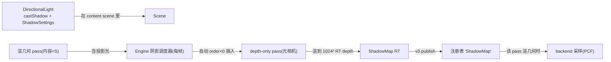

# 方向光阴影设计（v4b）

> 状态：**设计就绪，待评审**（2026-09-03）
>
> ⚠ 2026-09-03 **Design B 变更**：本文件描述的“Engine **自动**按需调度阴影”（目标 2、`Light`
> castShadow 一次性开关、Engine `addShadowPass`/`runShadowPasses`/`ShadowSlot`）**已从 RenderEngine
> 移除**——引擎不再有任何阴影子系统/自动调度。阴影 depth pass 现在就是一个普通注册 pass
> （自建光相机 + depth-only RenderTarget + order<0 + 内容绑定），由调用方/builder 显式配置；
> 常用配方归 `RenderPipelineBuilder`。`Light::castShadow()`/`ShadowSettings` 保留为语义描述
> （未来自定义 shader 采样 v4b-2/custom-shader 切片才真正消费）。下述 v4b 引擎自动调度设计
> 保留为历史演进记录。
>
> 前置：v1 有序多 pass ✅；v2 离屏 RTT（RT 天然支持“仅深度”）✅；v3 命名产出槽 publish/resolve ✅；
> v4a 光源（Scene 级 + per-pass 内容光下发 + vsg per-view 灯组）✅。
> 本设计满足三个诉求：**抽象**（SDK 只管“是什么/何时”，后端管“怎么渲”）、**用户可配置**（在
> `Light` 上一次性开关+参数）、**按需**（没有投影光 / 没有渲几何的消费 pass 就不建 RT、不跑 depth
> pass、不重编采样管线）。

## 0. 目标与非目标

目标：
1. 一个 `DirectionalLight` 设置 `castShadow()` 后，凡渲染该内容 scene 的几何 pass 都会产生硬/PCF 阴影。
2. 全部“阴影存在”逻辑由 Engine **自动**按需调度（无需用户手写 shadow pass / 手动串 RT）。
3. 参数可配且有合理默认：map 分辨率、bias、filter（None/Hard/PCF）。
4. 与 v3 命名产出槽 / v2 RT / v4a 灯一致，平台无关。

非目标（留 v5）：
- 点/聚光阴影、级联（CSM）、PCSS/软阴影高级过滤、同一 scene 多投影方向光。

## 1. 概念模型



要点：
- **一个 Light 两用**：既是“给场景打光的光源”，又是“其阴影 depth map 的光相机来源”。
- **消费端自动判定**：谁渲含投影光的内容，谁就接影（主视图、离屏 PiP 都投影）；例外 = 那个 depth
  pass 自己（渲 depth 不采样）。
- **按需 = 不跑无影帧**：无 castShadow 光 → 不建 RT / 不插 pass / 不编 shadowed 管线（首次遇到才编，
  缓存复用于同参数后续帧）。

## 2. SDK 抽象与配置

### 2.1 `Light`（v4a 已留 `castShadow`，本期补配置）

```cpp
enum class ShadowFilter { None, Hard, PCF };   // PCF 采样半径可后续加

struct V_GRAPHICS_API ShadowSettings {          // 值类型，随 Light 存
    uint32_t   resolution = 1024;               // map 边长（宽=高）
    float      bias       = 0.002f;             // 深度偏移（防自影）
    ShadowFilter filter    = ShadowFilter::Hard;
};

// Light 增量 API
void setCastShadow(bool) ;                          // 已预留
bool castShadow() const;                            // 已预留
const ShadowSettings& shadowSettings() const;
void setShadowSettings(const ShadowSettings&);
// 快捷：void setShadowResolution(uint32_t); setShadowBias(float); setShadowFilter(ShadowFilter);
```

默认值 = 用户只需 `light->setCastShadow(true)`，其余可不管。

### 2.2 RenderTarget —— 无需改
`RenderTarget` 已允许“仅 depth”（`valid() = (color||depth) && size>0`）。shadow map =
`size(resolution,resolution)` + `attachDepth(D16/D24)`（无 color）。

### 2.3 光相机 —— 复用现有 `Camera`
`Camera` 已有 `setViewMatrixAsLookAt(eye,center,up)` + `setProjectionMatrixAsOrtho(...)`：
- eye = 沿光方向（`-direction`）退到内容 AABB 之外；
- center = scene AABB 中心；
- up = 与光方向不平行的一轴；
- 正交窗口 = AABB 在该光空间的范围 + 近远余量。
- Engine 在首次调度时为该 light 建一个内部 `Camera`（由 scene 的 `boundingBox()` 推导；场景包围盒
  变化导致矩阵失配时，按帧轻量重算或仅在 bounds 变化时重建——先做“每帧重算矩阵，相机对象复用”）。

## 3. Engine：按需自动阴影调度（核心）

- Engine 新增私有：
  ```cpp
  struct ShadowSlot {
      const Light* light = nullptr;          // 谁投影
      intrusive_ptr<Camera> light_camera;    // 光正交相机
      intrusive_ptr<RenderTarget> depth_target; // resolution² depth-only
      intrusive_ptr<RenderPass> pass;        // 内部 depth pass（order 由调度决定）
      int last_used_order = 0;
  };
  std::map<const Light*, ShadowSlot> shadows_;  // 键 = Light 指针
  ```
- **每帧 `frame()` 管线执行前**做一次“shadow schedule”：
  1. 遍历将执行的几何 pass（main + extra，取其有效内容 scene）；
  2. 若内容含 `enabled && castShadow && Directional` 的光 L 且该 pass **不是** shadow pass：
     - 确保 `shadows_[L]` 存在（无则建 RT、光相机、内部 RenderPass；参数变则重建 depth RT）；
     - 记录它必须先于该消费 pass 执行（order 取“第一个需要它的消费 pass 的 order，再 -1”，并 <0；
       多个消费 pass 只要最小的）。
  3. 执行阶段：把这些 shadow pass 按 order 升序与 extra passes **归并**执行（类似 v1 排序，只是它们
     在用户 `extra_passes_` 之外、由引擎插入，用户不可见也不可误删）。
  4. publish：shadow pass 渲完把 `depth_target` publish 到注册表（名字 key 由 Engine 内部解析，消费
     几何 pass 由 Engine 直接告知 backend，不走用户字符串）。
  5. 每帧末/帧首清理：无消费 pass / 光被移除 / castShadow 关 → 释放 `shadows_` 条目（按需、无泄漏）。
- 调度只读用户配置（castShadow + 光参数 + 消费关系），**不改用户 pass 结构**；与 v5 自动依赖排序不冲突
  （v5 可把这段推广成通用“按需自动 pass 插入”）。

## 4. RenderBackend 契约（增量，默认 no-op）

```cpp
/** @brief Sets the shadow map source for a light during the upcoming render().
 *
 * Called by the engine before a pass renders geometry whose content contains
 * @p light (the pass that produced the shadow map binds null / is skipped).
 * Backends that sample shadows translate the target's depth into a sampled
 * shadow map; others ignore it. Borrowed for the call. */
virtual void setShadowMap(raw_ptr<const Light> light, raw_ptr<RenderTarget> shadow_target) {}
```
- 后端靠现有 `setLights`（知道有哪些光）+ 本调用（知道哪张 RT 是该光的 shadow）在渲几何时完成采样。

### vsg 后端映射
- **depth-only 离屏**（v4b-1）：扩展 `renderOffscreenTarget` 支持 `!hasColor && hasDepth`（只建 depth
  附件 + depth-only render pass + 光相机 view），depth image usage 加 `SAMPLED`、finalLayout 处理为可读。
- **采样**（v4b-2）：见 §6 方案，把 shadow RT 的 depth image 绑成该视图的 shadow 描述符。

## 5. 分期落地

| 阶段 | 范围 | 验收 |
|---|---|---|
| **v4b-1** | `Light::ShadowSettings`；Engine 自动调度（只跑 depth pass + publish，**先不采样**）；vsg depth-only 离屏 | GraphicsTest：配置存取/调度规则（含“无光不跑”）；lavapipe：日志见 shadow depth pass 运行、RT 内容 dump 出合理深度图 |
| **v4b-2** | 采样接入渲几何（shadowed shader/描述符 + Hard/PCF + bias/resolution 生效） | 主/离屏几何出现正确阴影；无伪影（真机+validation 复验） |

## 6. 采样方案（开放决策，v4b-2 前拍板）

- **方案 A：自建 shadowed Phong（推荐）**
  SceneBridge 为“接收影的几何”用一套**带 shadow 采样的 Phong 变体**（自嵌 GLSL/SPIR-V，新增 depth
  sampler 描述符）。优点：与 v2/v3 RT+命名槽架构一致、可控（filter/bias 自定）、不依赖 vsg 内置细节；
  缺点：要维护一套着色器。
- **方案 B：vsg 内置 ShadowSettings**（`HardShadows/SoftShadows/PCSS` 已在 vendored 1.1.16）
  给 vsg DirectionalLight 挂 ShadowSettings 让它自渲 shadow map。优点：少写 shader；缺点：与我们
  “Engine 管 RT/pass”的调度耦合弱（vsg 内部自己管理 shadow RT/每帧渲）、参数面受 vsg 限制、后续
  g-buffer/多光扩展受限。
- **先 A 后 B 的验证路**：无论 A/B 都先有 v4b-1 的 depth pass 打底；A 是我们既定方向，B 仅作备选在
  真机验证时评估。**默认 A**。

## 7. 关键决策记录

1. **阴影随 Light、随内容**：光源在 Scene 上（v4a），投影是其属性；谁渲该内容谁接影，无需 pass 级配置。
2. **Engine 自动按需调度**：shadow pass 不进用户 `extra_passes_`，由引擎在帧内按“消费 pass 的 order”
   自动归并插入；无消费/无投影光即不建不跑（含 GPU 资源释放）。
3. **配置收敛在 `Light::ShadowSettings`**：默认值让 `setCastShadow(true)` 即可用；高级项后加。
4. **depth map 走 v3 命名产出槽**语义（Engine 内部 key），避免与几何内容混淆。
5. **光相机复用 vine `Camera`**（已有 lookAt + ortho），正交窗口由 scene AABB 推导；Engine 内部持有。
6. **采样默认走自建 shadowed Phong（A）**；vsg 内置（B）备选，真机评估。

## 8. 开放项（已拍板 2026-09-03）

1. 采样方案：**A 自建 shadowed Phong**（已选）。
2. 投影光源数：**单方向光/内容**（已选；多光留 v5）。
3. 调度粒度：**半自动**（已选）——Engine 默认自动按需调度；另暴露**手动 API**：用户可自行
   `engine->createShadowPass(light, order)`（或等价）构造并注册该光的 shadow pass（此时该光不走
   自动调度，避免重复），获得对 order/内容的完全控制。

## 9. 落地记录（2026-09-03）

- v4b 决策锁定：A 自建 shadowed Phong；单投影方向光/内容；半自动调度（自动 + 手动 API 双轨）。
- 事实核对：`RenderTarget` 已天然支持仅 depth；vsg 1.1.16 vendored 带 ShadowSettings/HardShadows/
  SoftShadows/PCSS（方案 B 可用但弃用）；vine `Camera` 已支持 lookAt + ortho（光相机直接可建）。
- **v4b-1 已实现（CPU 单测 + lavapipe 实测）**：`Light::ShadowSettings`（resolution=1024/bias/Hard）；
  Engine 自动按需调度器 `runShadowPasses()`（帧首扫内容 scene 的 castShadow 方向光 → 光正交相机
  (lookAt+ortho, AABB 取景) + resolution² 仅深度 RT + 内部 RenderPass，先于主管线跑；无消费/空 AABB
  跳过；帧末释放不再需要的 auto slot）+ 手动 `addShadowPass(light, content)`（显式注册、自动让位）。
  vsg `renderOffscreenTarget` 支持 **depth-only 目标**（新 `makeDepthOnlyRenderPass`：storeOp=STORE、
  finalLayout=SHADER_READ_ONLY + external→fragment 读依赖；clearValues 按附件逐项填）。实测：
  VINE_VSG_OFFSCREEN 下日志出现 `EXPERIMENTAL off-screen target 1024x1024 attached`（shadow 先于
  640x360 颜色离屏），无崩溃/无 Vulkan 报错；GraphicsTest 77 全过（新增 Light.ShadowSettings +
  3 个调度用例：自动/无投影不跑/手动）。demo 的 sun 现 castShadow(true)。采样(v4b-2)未做。

## 10. v4b-2（采样）要点备忘

- SceneBridge 为“接收影几何”引入 shadowed Phong 变体：新增 `sampler2DShadow`/`sampler2D` 深度描述符，
  绑定光空间 VP（light camera 的 view/projection，Engine 已有）+ shadow RT 的 depth view；
  Hard = 单次 depth compare；PCF = 多次 compare 平均（filter/bias/resolution 已可配）。
- 几何 pass 与阴影 map 的绑定：Engine 在渲几何 pass 前把该 light 的 shadow RT 告知 backend（v4b-1
  已建 RT/相机，只差“采样接入”）。
- 平面演示：加一块地面，验证阳光在地面上的立方体投影；主/离屏同源都应投影。

