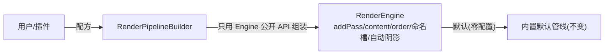

# RenderPipelineBuilder 设计（管线配方层）

> 状态：**已落地（recipe: offscreenToScreen）**（2026-09-03）
> ⚠ Design B 变更：RenderEngine 已无“内置零配置默认管线”（main pass 移除，空启动）。
> “默认 viewer”引导现在归 fw 层 `RenderControl`（passCount()==0 时注册默认窗口 pass）；Builder
> 相机回落用 `engine->masterCamera()`。本设计其余结论不变。
> 前置：v1 有序多 pass ✅、v3 命名产出槽 ✅、v4a 光源 ✅、v4b-1 阴影 depth 调度 ✅。
> 一句话：**Builder 是把“组装关系”收进可复用配方的薄层；运行语义（每帧调度/内容解析/光照/阴影）仍只在
> `RenderEngine`。不造第二个引擎。**

## 0. 动机与非目标

动机：现在拼一条像样的管线要手工串 `RenderPass`+`Scene`+`Camera`+`RenderTarget`+`order`+输出/输入命名，
细节多、易错、不可复用（demo 的离屏→PiP 就是手写样板）。

非目标：
- ❌ 不引入“图 DSL + 图执行器”（那是 v5 自动帧图才做）。
- ❌ 不改 `RenderEngine` 的运行语义（排序/内容解析/光照/阴影调度仍归 Engine）。
- ✅ Engine 不再提供零配置默认管线；默认 viewer 由 fw `RenderControl` 引导（Builder 面向需要
   显式/可复用管线的调用方）。

## 1. 位置与边界



- Builder **产出 = 手写完全相同的对象**，只是不再手写。
- 每帧怎么跑（order 归并/有效内容解析/publish-resolve）Builder 不碰。
  （注：Design B 后 Engine 已无 runShadowPasses/自动阴影——阴影 depth pass 由 Builder 配方显式注册。）
- 阴影“要不要跑”仍是 Engine 自动调度决定（scene 里 castShadow 光）；Builder 只负责把
  “带影的 lit 场景配方”配置到 scene/engine，不复制调度。

## 2. API 形态

```cpp
// sdk/vine/graphics/RenderPipelineBuilder.hpp
class V_GRAPHICS_API RenderPipelineBuilder {
  public:
    explicit RenderPipelineBuilder(raw_ptr<RenderEngine> engine);   // 目标 engine（借用）

    // ---- 通用输入（可从 Engine 默认取） ----
    RenderPipelineBuilder& scene(intrusive_ptr<Scene> scene);
    RenderPipelineBuilder& camera(intrusive_ptr<Camera> camera);

    // ---- 配方：场景主 pass（Engine 默认等价） ----
    // 提供显式 scene/camera；不调则用 engine 当前默认（保持零配置路径）。

    // ---- 配方：离屏 → PiP/后处理上屏 ----
    // 建 off-screen RT(尺寸/格式) + order<0 场景 pass(输出名) + ScreenPass(输入名, 视口)。
    RenderPipelineBuilder& addOffscreenToScreen(const String& output_slot, int width, int height,
                                                RenderTarget::ColorFormat color, RenderTarget::DepthFormat depth,
                                                int pip_x, int pip_y, int pip_w, int pip_h);

    // ---- 配方：带方向光阴影的场景（v4b） ----
    // 等价：scene 加 castShadow 方向光；引擎自动调度 depth pass；lit pass 采样（v4b-2 后）。
    RenderPipelineBuilder& addShadowedScene(intrusive_ptr<Light> sun);

    // ---- 手动混用出口 ----
    raw_ptr<RenderPass> addPass(intrusive_ptr<RenderPass> pass, int order);   // 直接转发

    void build();  // 把所有配置一次性应用（幂等：重复调用需先 reset 或约定 build-once）
  private:
    raw_ptr<RenderEngine> engine_;
    // 组装过程的中间态：显式 scene/camera、已建 pass 的持有引用等
    std::vector<intrusive_ptr<RenderPass>> owned_passes_;   // builder 产出的 pass 由其持有，engine 另持引用
    ...
};
```

要点：
- Builder **持有产出对象的引用**（保证 RT/pass 生命周期），Engine 通过 `addPass` 也持引用；生命周期
  以“谁建谁保底”为准（builder 对象销毁后由 engine 保活，与应用持有的 RT 一致，沿用现有约定）。
- 只允许流式一次 `build()`；重复构造用新的 Builder（避免状态混乱）。

## 3. 四个“常用配方”映射到现有 API（落地时逐条对照）

| 配方 | Builder 内部做的事（全部走 Engine/RenderPass 公开 API） |
|---|---|
| **sceneOnly**（默认 viewer） | `engine->setScene/setMasterCamera`；fw `RenderControl` 在 `passCount()==0` 时注册默认窗口 pass（order 0、camera=masterCamera、RT=null） |
| **offscreenToScreen** | 建 `RenderTarget`(size+color+depth)；建 order<0 `RenderPass`：`setCamera(engine.camera)`+`setRenderTarget(rt)`+`setOutputName(slot)`，`engine->addPass(pass,-2)`；建 `ScreenPass`：`addInputName(slot)`+`setViewport(…pip…)`，`engine->addPass(screen, 100)` |
| **shadowedScene** | 显式注册 order<0 depth pass：自建光相机(lookAt 光向/AABB 取景) + depth-only RT + `engine->addPass(shadow, content, -N)`；`scene->addLight(sun)`（`castShadow` 仅作语义标志，引擎不再自动调度） |
| **手写混用** | 直接 `engine->addPass/…`，Builder 只是入口别名 |

> 由此也印证：Builder 不需要懂“阴影怎么渲/采样”，那仍是 v4b-1/2 + Engine 的职责。

## 4. 与现有机制的关系（明确“谁管什么”）

- 命名产出槽（v3）：Builder 负责把 `outputName/inputName` **填对**；运行时 resolve 仍归 Engine。
- Design B 后阴影不再自动调度（v4b-1 引擎机制已删）：Builder 负责把“shadowedScene”配方展开成显式
  depth pass（光相机 + depth-only RT + order<0）注册进 engine；采样仍待 v4b-2/custom-shader 切片。
  “何时跑/何时释放”仍归 Engine。
- ScreenPass/PiP：Builder 建对象+视口；PiP 定位若依赖表面尺寸，仍由应用在后端就绪后调
  `screen_pass->setViewport(...)`（Builder 提供默认锚点，见下条）。
- Engine 默认主 pass：**保持**（builder `sceneOnly` 与之等价但不替代）。

## 5. 建议落地顺序（小步验证）

1. **先做 recipe #2 `offscreenToScreen`**，把 app_shell demo 那段手写（RT/pass/ScreenPass/PiP 锚定）
   改写成 Builder 调用——用现有可视化（PiP 正确）验收 Builder 模式本身。
2. 再补 `shadowedScene` 配方（与 v4b-2 采样落地后一起接线）。
3. 视需要补 sceneOnly/其余配方。
4. GraphicsTest：Builder 产出的结构与手写等价（pass 数/命名槽/视口），不新增运行语义。

## 6. 关键决策记录

1. Builder 是**薄组装层**，只用 Engine/RenderPass 公开 API，不复制运行语义。
2. Engine 默认零配置管线**保留**；Builder 是显式/可复用路径，二者并存。
3. Builder 持有自己产出的对象引用（RT/pass），应用/Engine 照常持有；沿用现有生命周期约定。
4. 先以 `offscreenToScreen` 配方落地并用 demo 可视化验收，避免一次铺开过度设计。
5. v5 若做自动帧图，Builder 是天然的前置“声明式描述”层；本设计不为 v5 提前做图执行器。

## 7. 落地记录（2026-09-03）

- **Recipe #1 已实现并验收**：新增 `RenderPipelineBuilder`（sdk/vine/graphics，薄层：`setContent/setCamera` +
  `addOffscreenToScreen(output_slot, rt, 格式, pip 视口)` + `addPass` 手写出口）。每个 add* 立即应用到 engine，
  产出对象 builder 与 engine 双持；返回 ScreenPass 供表面就绪后再锚定视口。
  app_shell demo 的手写 offscreen→PiP 段已改为 Builder 调用（灯/内容绑定仍属应用层）。
  GraphicsTest 78 全过（+1 `RenderPipelineBuilderTest.OffscreenToScreenBuildsExpectedPipeline`：2 个 pass、
  resolve SceneColor、screen 采样一次）；lavapipe 截图 PiP 与主画面一致（无回归）。
- 待做：`shadowedScene` 配方（与 v4b-2 采样落地后一起接线）；必要时 sceneOnly 等其余配方。


## Design C 更新（2026-09-08）：主窗管线预设 + SceneView 默认统一
- ⚠ Design B/C 后：引擎无 masterCamera/setScene、无内置默认管线；主窗“默认 viewer”由 SceneView 引导（ensureWindowPass，hasWindowPass(camera) 抑制重复）。本设计此前“sceneOnly=engine.setScene/setMasterCamera + RenderControl 默认 pass”已过时。
- 落地：`RenderPipelineBuilder::build(PipelinePreset, PipelineOptions)` → `intrusive_ptr<Pipeline>`（新 RenderPipeline.hpp/.cpp）。
  - Forward（含 ForwardShadowed 占位）：order-0 窗口场景 pass（camera+content）。
  - Deferred（含 DeferredShadowed 占位）：order-3 gbuffer 场景 pass（MRT：albedo RGBA8 / view-normal+shininess RGBA16F / spec RGBA8 / view-pos RGBA16F + D24；发布 "GBuffer"；program override）→ order-0 全屏延迟光照 ScreenPass（采样 GBuffer、带 camera、绑 content 转发 scene 灯光）即窗口 pass → 使 hasWindowPass(camera)=true，SceneView/RenderControl 不再叠 forward。
  - Deferred **默认自带临时 shader**（builder 公共静态 `defaultGbufferGeometryProgram()`/`defaultDeferredLightProgram()`）与 **canonical G-buffer target**（公共静态 `defaultGbufferTarget(w,h)`，builder 与 A/B 预览共用），调用方零 GLSL；PipelineOptions 的 gbuffer/lighting program 为可选覆盖（自定义着色）。缺 camera/content → 返回 null 且不注册。
  - 注：内置 GLSL 是**临时默认**（vsg-ABI 具体），后续应由 vsg 后端提供内置 deferred 着色集（对齐现有 ShaderPreset），届时 builder 默认改为向后端取、移除 SDK 内 GLSL。
  - G-buffer 尺寸：options.offscreen_* → engine surface → 640×360 兜底；`Pipeline::resize(w,h)` 由宿主维护（可挂 SceneView::addSurfaceLayout）。
- SceneView::ensureWindowPass 改走同一 Forward preset（不再手搓 pass）：全仓主窗管线只有一套 recipe。内部持 `default_pipeline_`（intrusive_ptr<Pipeline>），dtor/setEngine 经 removeWindowPass() 移除。
- 可配 gizmo overlay：`PipelineOptions::gizmo`（AxisGizmoOptions：source_camera(null=禁用)/pixel_ratio/box_size/axis_length/thickness/order）。build() 挂 AxisGizmo HUD pass；Pipeline::resize(w,h) 一并重锚 gizmo（一次 surface-layout 管 gbuffer+gizmo）。AppShell 默认（无 env）也经 builder Forward preset 装配，gizmo 随 options 配置。
- AppShell（2026-09-08）：demo 收拢。`VINE_PIPELINE`（forward|deferred|forward_shadowed|deferred_shadowed）选主窗 preset（addDemoPipeline；旧 VINE_VSG_DEFERRED_FULL=deferred 别名）；deferred 用 `pipeline->offscreenTarget()!=nullptr` 判定并挂 addSurfaceLayout→resize 随窗。`VINE_VSG_GBUFFER` 逐附件预览已基于 canonical 重建（默认 program+target，4 个 ScreenPass 预览 0..3）。SlotOverlay/MultiSlot 等后端机制验证器保留（标注非 preset 示例）。
- 阴影占位：ForwardShadowed/DeferredShadowed 现=无阴影版，预留 order<0 depth-only + 阴影化采样点。
- test_graphics 129/129；全量构建绿。AppShell 手搓 deferred demo 暂未迁移（可后续 build(Deferred,{programs})）。
