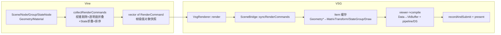
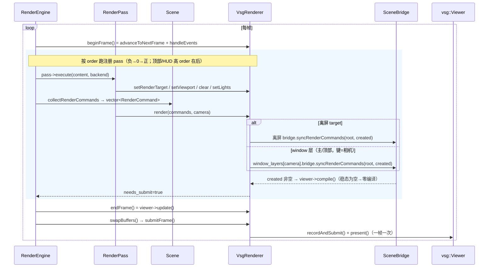
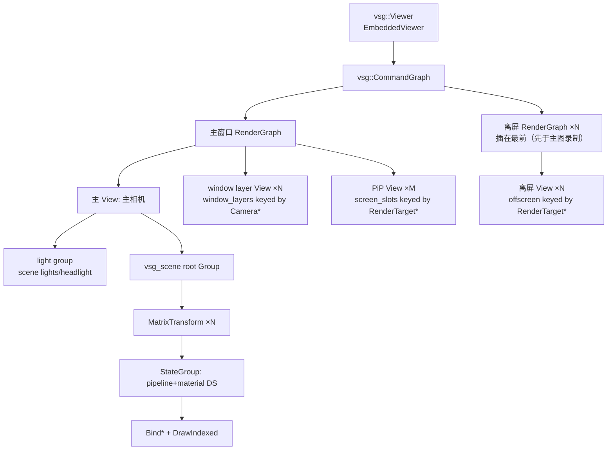

# gfx_backend_vsg 模块全解（架构 / 数据链路 / 生命周期 / 未定义行为）

> 模块：`src/plugins/gfx_backend_vsg`
> 版本依据：2026-09-04 工作区代码（`git` 后状态）+ 本机 vsg v1.1.16。
>
> 本文件是模块级**综合文档**：讲清类职责、数据链路、图结构、生命周期、资源
> 清理、resize / pass 移除行为，以及**未定义行为 / 内存 / 线程 / 异常安全**风险。
> 纯数据格式与 ShaderSet 契约、顶点读取细节见同目录
> [`vine-to-vsg-data-flow.md`](./vine-to-vsg-data-flow.md)（本文件引用它，不重复整表）；
> 早期设计历史见 `.ai/design/vsg-design.md`；自定义着色 ABI 见 `.ai/design/vsg-custom-shader.md`。
>
> ⚠️ **当前工作区状态（2026-09-04，C6 重构后）**：`VsgRenderer` 不绑定任何 Vine Scene/Camera
> （`RenderBackendFactory/Registry::create()` 无参）；`Overlay` 类已删（顶部/HUD = 高 order 普通 pass，
> 见 `.ai/design/graphics-overlay.md`）。后端维护单一 `targets[RenderTarget*]` 表（nullptr 键 = 窗口），
> 窗口与离屏**同构为统一 `Target`**：每个 target = 一个 RenderGraph + 按 `(camera, pass order)`
> 键的 `content_slots[]`（每槽 = 保留 View/root/SceneBridge）+ PiP `screen_slots[]`；窗口图 = 共享
> swapchain 图，离屏 target 自持附件（image/view/render_pass/framebuffer）。主/顶(HUD) 由 `clear()`
> 标记判定（清屏→depth-on 主槽，否则 depth-off+ambient 顶部槽）；同 target 多个不同 order 槽 = 各自
> 独立保留 ContentSlot 顺序叠画（窗口与离屏同一套代码，`renderContentSlot`/`setupContentSlot` 单一
> 路径；`buildOffscreenTarget` 只建附件+空图）。每 pass 执行前引擎
> `RenderBackend::setPassOrder(order)` 把用户显式 order 通知后端（即该相机的内容槽键）；移除 pass 时
> 引擎 `RenderBackend::releaseWindowLayer(camera, order)` 释放（早期 `contentSlot`/`setContentSlot`
> 轴与 `primary_camera`/`vsg_camera`/`vsg_scene` 主槽别名已删，窗口即 targets[nullptr]）。
> target 内叠画顺序 = 用户显式 pass order
> （`ContentSlot.order`，`setupContentSlot` 按 order 升序插入子 View；PiP 视为最高阶）——不用
> main/HUD 语义限序；深度风格(depth-on/off、光照)由 `clear()` 标记判定，与顺序解耦。按显式 order
> 归位天然处理引擎 warm-up 越序建槽（不再出现 [HUD, MAIN] 把 HUD 盖住）。早期 B1
> （残留 `delete d;`）已修复。
> **本文第 7/11/12 节架构文字撰写于 C6 之前**（描述三桶 window_layers/offscreen/screen_slots、绑
> scene/camera、renderOffscreenTarget/setupWindowLayer 等旧形态），当前形态的权威说明见
> `.ai/design/vsg-target-unification.md` 与代码本身；该等章节的全量改写为待办。
>
> ⚠️ **2026-09-08 更新（管线共享基础已落地）**：`SceneBridge` 的 `shared_objects_`
> 已接入（此前声明未赋值 = 文档-代码漂移），同 (program×状态×槽位) 的几何共享一条
> pipeline；并新增 L1 program ShaderSet 缓存与 L2 变体模板缓存（跳过重复
> configurator）。权威设计见 `.ai/design/vsg-pipeline-sharing.md`；回归测试见
> `tests/test_vsg/SceneBridgePipelineSharingTest.cpp`（含 1k 量级不变量）。

## 1. 模块定位与插件模型

`gfx_backend_vsg` 是 `vine::graphics` 渲染抽象（`RenderBackend`）的**第一个真后端**，
以 appfw **MODULE 插件**（动态库）形式交付。它把 graphics 层的场景图 / 相机 /
渲染命令翻译成 **VulkanSceneGraph（VSG）** 调用。

```
┌────────────────────────────────────────────┐
│ graphics（抽象层，无三方依赖）                │
│  RenderBackend / RenderBackendRegistry      │
│  RenderEngine / RenderPass                  │
│  Scene / Node / Geometry / Material / Camera│
└───────────────────┬────────────────────────┘
                    │ 按名创建 "vsg"（运行时插件）
┌───────────────────▼────────────────────────┐
│ gfx_backend_vsg（MODULE 插件）               │
│  GfxBackendVsgPlugin  → 注册工厂             │
│  VsgRenderer : RenderBackend                │
│  ├─ SceneBridge   命令流 → 保留式 vsg 场景   │
│  ├─ CameraBridge  Camera → vsg::Camera      │
│  ├─ VsgMaterialManager  Material → Phong    │
│  └─ RenderStateMapper  ResolvedState→管线态  │
└────────────────────────────────────────────┘
```

- 插件 `load()` 把 `static VsgRenderBackendFactory s_factory` 注册进
  `RenderBackendRegistry`；上层 `registry.create(u8"vsg")` 拿后端（C6 起无参：
  引擎逐 pass 驱动内容，后端不绑 Vine scene/camera），不依赖本模块或 VSG 库头文件。
- 命名空间：实现都在 `vine::vsg`（`V_VSG_NS_BEGIN/END`）；graphics 类型在
  `vine::graphics`；vsg 类型全局 `::vsg`。
- 头文件放 `include/vine/vsg/`，其中 `RenderStateMapper.hpp`、`VsgUtils.hpp` 是
  header-only；类主体在插件 `src/`（不进公共 SDK 树）。

## 2. 目录与文件结构

```
src/plugins/gfx_backend_vsg/
  CMakeLists.txt                  # v_add_plugin + FetchContent(vsg/glslang)
  include/vine/vsg/
    vsg_global.hpp                # V_VSG_API 导出宏 + 命名空间宏（查 V_VSG_LIB）
    VsgRenderer.hpp               # 后端（PIMPL：struct Impl; unique_ptr<Impl> impl）
    SceneBridge.hpp               # 命令流 → 保留式 vsg 场景（保留缓存声明在此）
    CameraBridge.hpp              # 相机桥
    VsgMaterialManager.hpp        # 材质管理器（实现 graphics::MaterialManager）
    RenderStateMapper.hpp         # ResolvedRenderState → 4 个 vsg 管线态（header-only）
    VsgRenderBackendFactory.hpp   # 工厂（按名创建后端）
  src/
    VsgRenderer.cpp               # 后端主体（约 1600 行）
    SceneBridge.cpp               # 保留 Item 缓存 / buildGeometry / syncRenderCommands
    CameraBridge.cpp
    VsgMaterialManager.cpp
    VsgRenderBackendFactory.cpp
    GfxBackendVsgPlugin.hpp/.cpp  # 插件外壳 + V_DECLARE_PLUGIN
    VsgUtils.hpp                  # detail::toVsg(Mat4d→dmat4)
  shaders/                        # 早期手工 flat shader（flat.vert/frag[.spv]，已不被构建使用）
  vsg_shader_dump/  vsg_probe/    # 独立探查工具 main.cpp（不进插件构建）
  vine-to-vsg-data-flow.md        # 数据映射专项文档
  gfx_backend_vsg.md              # 本文
```

`v_add_plugin` 由短名推出 `V_GFX_BACKEND_VSG_LIB`，但头文件查 `V_VSG_LIB`，所以
CMake 里显式 `target_compile_definitions(... PRIVATE V_VSG_LIB)` 让 `V_VSG_API`
在构建本插件时展开为 `V_EXPORT`。

## 3. 构建与依赖

- `v_add_plugin(GFX_BACKEND_VSG_TARGET gfx_backend_vsg)`：MODULE 库。
- `VINE_USE_FETCHCONTENT=ON`（推荐）：静态编译 glslang + vsg v1.1.16 打进插件；
  保留运行期 `vsg::ShaderCompiler`（程序路径需要）。
  - 先 `find_package(glslang QUIET)`；没有再 Fetch glslang 16.2.0，并把它的
    `SPIRV/` 头镜像到构建树、生成 `glslang-config.cmake` 指向 in-tree，让 vsg 的
    `find_package(glslang)` 命中，`VSG_SUPPORTS_ShaderCompiler=ON`。
  - vsg 静态库把 glslang 的 private 依赖 re-export 进 `vsgTargets`，故需把
    glslang 各 target 塞进 vsg 的 export set（安装规则在树内 inert）。
- `VINE_USE_FETCHCONTENT=OFF`：走 vcpkg / 本机安装的 vsg（如 `/opt/opensrc/VSG`）。
  ⚠️ 无 glslang 的预装 vsg **禁用运行期 shader 编译** → program 路径静默失效
  （登记 D12）。默认 phong 用内嵌 SPIR-V blob，无需 glslang 也能渲染。
- 链接：`vsg::vsg`（PUBLIC，因 `SceneBridge` 对外 API 暴露 `vsg::ref_ptr<vsg::Node>`）
  + appfw（插件基类）+ graphics（接口 + registry）。
- 部署：`<exe>/plugins/vine/gfx_backend_vsgd.*`（v_add_plugin 规则）。
- 测试：`tests/test_vsg` 不能链 MODULE 库，改为**直接编实现源文件**做集成测试。

## 4. 核心类职责一览

| 类 | 职责 | 备注 |
|---|---|---|
| `VsgRenderer` | 实现 `RenderBackend`：窗口/Viewer/RenderGraph、窗口层（主/顶部/HUD）、离屏、PiP、帧提交 | PIMPL(`Impl`)；绑 raw `Scene*`+`Camera*`；on-screen 层统一 `window_layers` |
| `SceneBridge` | 把每帧命令流保留式 reconcile 到一棵 `vsg::Group`；按 `Geometry*` 缓存 Item | 每个 window 层 / 离屏 target 各一套（vsg 按 viewID 编管线） |
| `CameraBridge` | `Camera`（eye/target/up + fov/ortho）→ `vsg::LookAt` + `vsg::Perspective/Orthographic`；`apply()` 原位同步 | vsg 相机不含 viewportState（渲染器补） |
| `VsgMaterialManager` | `Material*` → 缓存 `vsg::PhongMaterialValue` | 实现 `graphics::MaterialManager` |
| `RenderStateMapper` | `ResolvedRenderState` → DepthStencil/Rasterization/ColorBlend/InputAssembly 四态 | header-only；含 reverse-Z 深度比较反转 |
| `VsgUtils::detail::toVsg` | `Mat4d` → `vsg::dmat4`（列主序复制） | header-only |
| `VsgRenderBackendFactory` | `create/info` + 静态 `Registrar` 自注册 | 插件加载也注册一次 |
| `GfxBackendVsgPlugin` | 插件外壳，`load()` 注册工厂 | `V_DECLARE_PLUGIN` |

## 5. 分层数据链路（命令流 → 保留式 vsg 场景）

一句话：**Vine 每帧收集"命令流"（立即模式快照）→ `SceneBridge` 拿它当 diff 去
对账一棵常驻 vsg 场景（保留模式）→ 结构变化才重建 + compile → `recordAndSubmit`。**



### 5.1 Vine 侧收集（`Scene::collectRenderCommands`）

- 逐 `Node` 递归，做**视锥剔除**（每节点 AABB vs 视锥），叶子 `Geometry` 产一条
  `RenderCommand{geometry, material, program, modelMatrix, opacity, isTransparent,
  resolvedRenderState}`。
- `opacity` 沿树相乘（scene×祖先×叶，材质不贡献）；`isTransparent=opacity<1-ε`。
- `resolvedRenderState` = 沿祖先链把每个 `StateNode` 的 `RenderState` 折叠（深层
  覆盖浅层）后 `resolveRenderState` 成平面结构；`program` 同理叶优先再逐级祖先。
- 排序：opaque 前→后、transparent 后→前（painter）。

### 5.2 驱动：`RenderPass::execute` / `ScreenPass::execute`

引擎逐 pass 调 `RenderPass::execute`，它依次对后端调用：
`setRenderTarget → (setViewport?) → (clear?) → setLights → render(commands, camera)`。
`ScreenPass` 则 `setRenderTarget → (setViewport?) → drawScreenTexture(source)`。
（`RenderBackend::executePass` 虽是纯虚但引擎不走它；`VsgRenderer::executePass`
只是 clear+render 的便捷实现。）

### 5.3 保留式 reconcile（`SceneBridge::syncRenderCommands`）

对每条命令，以 `Geometry*` 为键在 `cache_` 找 `Item`：

- 判据变化才**重建该几何的子树**：`geometry->revision()` / 材质对象指针 /
  `resolvedRenderState` / program 指针任一不同。
- 稳态每帧只做廉价操作（见 §6 表）。
- 不在本帧的几何：从 root 摘下但**保留 Item**，`absent_frames` 超 600 才逐出。
- 根 children 顺序跟随（已排序的）命令流，顺序变了才重排 → opaque/透明 painter 序
  由命令序承载。

重建调用 `buildGeometry`：读 loc0(位置)+可选 loc1(法线/推导)+索引 → 物化成
`vsg::vec3Array / uintArray / vec4Array` → `GraphicsPipelineConfigurator` 按名字
喂 `vsg_Vertex / vsg_Normal / vsg_Color` + `material` descriptor（默认路径），或
`vsg_Vertex` + 自建 `pc` ShaderSet（program 路径）→ 按 `ResolvedRenderState` 装管线态
→ `StateGroup` 挂 `BindVertexBuffers + BindIndexBuffer + DrawIndexed`。
**顶点数据/世界变换/透明度、材质字段的完整映射与 ShaderSet 契约表**
见 `vine-to-vsg-data-flow.md`。

### 5.4 GPU 上传 / 编译

`syncRenderCommands` 把新建/重建子树收进 `created`；调用方（`VsgRenderer`）在
`created` 非空时 `viewer->compile()`（**当前全图编译**，非增量）。稳态帧
`created` 为空 → **零编译**。编译即 vsg 的 `Data→VkBuffer` 上传 + 建
pipeline / descriptor set。

## 6. 帧循环与每帧成本

引擎 `RenderEngine::frame(dt)` 驱动：



`VsgRenderer::frame()`（便捷单帧）：`beginFrame→endFrame→render({},camera)→swapBuffers`。

**每帧脏检查与动作**（`syncRenderCommands` 内逐几何）：

| 变化 | vsg 动作 | 重建/编译 |
|---|---|---|
| 世界矩阵（`cmd.modelMatrix`） | 写 `MatrixTransform::matrix`（变了才写） | 无 |
| 透明度 `cmd.opacity` | 覆写保留白色 `colors[].a`（变了才写） | 无 |
| 同材质改颜色/光泽 | 原位覆写共享 `PhongMaterialValue`（每帧循环） | 无 |
| 顺序变化 | 重排 root children 匹配命令序 | 无 |
| 隐藏/剔除缺席 | 摘下 root，Item 保留；>600 帧逐出 | 无 |
| 首次出现 / revision / 换材质对象 / renderState / program 变 | 重建该 Item | 有（全图 compile） |

**要点**：稳态帧成本 ≈ 每几何几次指针/浮点比较 + 材质 uniform 覆写；**不重建节点、
不建管线、不编译**。透明排序依赖命令序（root 子序），混合**恒开**由逐顶点 alpha
承载（代价：opaque 也走 alpha 混合，GPU 固定小开销）。

## 7. 图结构与多 View

后端维护一个 `vsg::Viewer` + 一个 `vsg::CommandGraph`，图上有**一棵主场景树 +
若干附加 View**：



### 7.1 主 View（on-screen）

- `initialize()` 调 `setupWindowLayer(impl->camera, on_top=false)` 建主窗口层：
  `CameraBridge::create` 得 vsg_camera、root `Group`、light group（scene 有灯则建灯节点，
  否则 `createHeadlight()`）、`View::create(vsg_camera)`；别名 `vsg_camera/vsg_scene` 指向主层。
- `render_graph = RenderGraph::create(window, primary.view)` → 挂 `command_graph` →
  `viewer->assignRecordAndSubmitTaskAndPresentation(...)` → 首次 `compile()`。
- 主内容在 `initialize()` **预编译一次**（`collectSceneCommandsNoCull` 不剔除地
  收集首帧可见内容，绕过“运行期新增编译不可靠”的历史坑）。

### 7.2 Window Layer（HUD / 顶部层）

- `window_layers` 以 **pass 的相机指针**为键，主层即 `camera == impl->camera` 那一项。首次遇到某相机
  （`setupWindowLayer(cam, cam != impl->camera)`）建：`CameraBridge::create` + `vsg_camera` +
  顶部层一个环境光（避免方向光导致轴随视角变黑）+ 内容 root；作为**主 RenderGraph 的额外
  View** 加入（同一 render pass 内多 viewport），顶部层用 `depth_off_shader_set`（深度 test/write
  关）的 layer bridge 同步内容，再 compile。
- 每帧（`renderWindowLayer`）：把该层相机 viewportState 设成对应 pass 的子矩形（无则全屏）→
  `CameraBridge::apply` → `layer.bridge.syncRenderCommands` → created 非空则 compile；只有非
  顶部层才 `setGroupLights(lights)`。
- 移除见 §12；`RenderEngine::initialize` 会对已注册的 enabled 且**不清屏**的 pass **预热一次**
  （先建好、编译好，避免帧中途首见编译不可靠）。

### 7.3 离屏 RenderTarget（EXPERIMENTAL）

- `offscreen` 以 `RenderTarget*` 为键。`renderOffscreenTarget` 首次为该 target
  建 GPU 附件（color ± depth image/view）、`makeSampleableRenderPass`（color 附件
  以 `SHADER_READ_ONLY_OPTIMAL` 结束，供后续采样）或 `makeDepthOnlyRenderPass`
  （shadow map 基础）、`Framebuffer`、独立 `RenderGraph`（`VK_SUBPASS_CONTENTS_INLINE`，
  自定义 clearValues）、自己的 `View` + `CameraBridge::create` + light group +
  root + **专用 `SceneBridge`**（不能与主 bridge 共用：vsg 管线按 viewID 编译，
  共用会 `GraphicsPipeline::vk()` 崩溃）。
- 该离屏 graph **插入 command_graph 最前** → 主窗口 PiP 在同一帧采样时纹理已最新。
- 每帧 `cameraBridge.apply` + `off.bridge.syncRenderCommands`，created 非空则 compile。

### 7.4 PiP / ScreenPass（EXPERIMENTAL）

- `screen_slots` 以 **source RenderTarget*** 为键；`drawScreenTexture(source)` 首次建
  `makeScreenTextureNode`（顶点着色器用 `gl_VertexIndex` 生成全屏三角形，片元采样
  离屏 color view，深度 test/write 关）+ 一个带子矩形 `ViewportState` 的相机 +
  作为主 RenderGraph 第二个 View。
- 每帧更新该相机 viewportState 跟随 `setViewport` 队列的矩形（越界自动右下角
  16:9 贴边）；source 尺寸变化 → 丢弃旧 slot 重建。

## 8. 相机桥接（CameraBridge）

- `Camera` 是 OSG 风格：完整 view/projection 矩阵由 eye/target/up + 投影参数表达。
- `create()`：`vsg::Camera(projection, viewMatrix=LookAt)`，然后 `apply()`。
- `apply()`：写 `LookAt.eye/center/up`；按投影类型原位建/更新
  `vsg::Perspective`（fovY/aspect/near/far）或 `vsg::Orthographic`
  （由 orthoHeight×aspect 得 half_w/half_h）。
- vsg 相机**不带 viewportState**（桥无窗口概念）；`VsgRenderer` 在 initialize/resize
  时用 `window->extent2D()` 补 viewportState，`RenderGraph` 每帧从它取渲染区域。

## 9. 材质管理（VsgMaterialManager）

- `getOrCreate(Material*)`：以 `Material*` 为键缓存 `vsg::PhongMaterialValue`
  （同一材质多几何共享一个 uniform 资源）；null → 默认灰。
- 每帧 `syncRenderCommands` 尾部：对每条命令 `getOrCreate`（命中缓存）并把
  diffuse/specular/ambient/shininess **原位写进共享值** → 同材质改色即时生效、
  零 rebuild；`diffuse.a` 恒 1（透明度走 per-vertex alpha）。
- 抽象基类接口：`updateMaterial / releaseMaterial / clear / find / materialCount /
  hasMaterial / forEachMaterial`。
- ⚠️ `updateMaterial/releaseMaterial` **全仓无调用点**（登记 D13）→ 缓存只增不减，
  最像内存泄漏的留存；shutdown 时 `clear()`。

## 10. 渲染状态映射（StateNode / reverse-Z / 深度约定）

- 状态在**收集期**已折叠进 `RenderCommand.resolvedRenderState`，vsg 侧不存在“StateNode
  节点”。`Item` 记录上一次 `render_state`，每帧比较，变了才重建管线。
- `RenderStateMapper` 把平面状态映射成 4 个 vsg 态：
  - **深度**：test/write 1:1；**比较符反转**（`Less→GREATER` 等）。注释称后端走
    reverse-Z 约定（近→NDC depth 1、远→0、clear 0）。⚠️ `CameraBridge` 目前给的是
    普通 `vsg::Perspective`，reverse-Z 是否真成立取决于 vsg 默认投影实现——若默认
    非 reverse-Z，则 StateNode 比较语义需复核（登记为待验证项）。
  - **剔除/多边形**：`cullMode` 映射，`frontFace` **固定 CCW**（配合 vsg Y-flip）；
    `polygonMode` Fill/Line/Point。
  - **混合**：**恒开**（`blend.enabled=false` 不关混合，只回默认因子
    SrcAlpha/OneMinusSrcAlpha）——因为透明度走 per-vertex alpha 随时可能 <1；
    单 color attachment，MRT 未做。
  - **拓扑**：Triangles/Points/Lines → `TRIANGLE_LIST/POINT_LIST/LINE_LIST`。

## 11. 生命周期与所有权总表

| 对象 | 谁持有 | 生命周期契约 | 违反后果 |
|---|---|---|---|
| Vine `Scene/Node/Geometry/Material/Camera/Light/ShaderProgram` | 场景树/调用方（`intrusive_ptr`，RefCounted） | 后端只存 **raw 指针**，不延长生命 | 悬垂（见 §14） |
| `VsgRenderer` 绑定的 `Scene* / Camera*` | 调用方 | **必须活得比渲染器久**（构造文档明示） | initialize/render/frame 解引用 UB |
| `SceneBridge::cache_` key `Geometry*` | 场景树 | 键存活由场景树保证；几何真删除后最多滞留 600 帧 | 地址复用错配（§14-1） |
| `VsgMaterialManager::cache` key `Material*` | 同上 | 同上；无逐出 | 同上 + 只增不减留存 |
| `SceneBridge::material_manager_` | `raw_ptr<VsgMaterialManager>` | **manager 必须活得比 bridge 久**（接口约定） | bridge 析构若触碰则悬垂（当前析构为空，无碍） |
| vsg `ref_ptr<Window/Viewer/Graph/Camera/Node/Image/...>` | vsg 引用计数 | `Impl` 成员；shutdown 显式置空 | 引用未清 → 撞 `VSG_MAX_DEVICES==1` / 资源滞留 |
| `window_layers/offscreen/screen_slots` key `Camera*/RenderTarget*` | `Impl` 成员 map | 引擎移除 pass/target 时须调 `releaseWindowLayer/releaseRenderTarget`；否则资源到渲染器析构才释放 | 悬垂 key / 延迟释放 |
| 命令流 `vector<RenderCommand>` | 帧级栈对象 | 内部 `intrusive_ptr` 帧末释放 | —（帧内借用安全） |
| `GfxBackendVsgPlugin` 的 `static s_factory` / `Registrar` | 进程级静态 | 插件 load 注册 / unload 不动 | 跨 TU 静态初始化序（§14-9） |

### 11.1 PIMPL / Impl 内部成员

`VsgRenderer` 用 `std::unique_ptr<Impl> impl` 持有全部实现状态（窗口/图/缓存/槽等）。
`Impl` 内**不拥有** Vine 对象；全用 vsg `ref_ptr` 拥有 GPU 对象。构造时
`impl(new Impl())` 并写 scene/camera；析构先 `shutdown()` 再释放 `impl`（B1 已修复：
析构即 shutdown()）。**注意**：`Impl` 析构会释放 `window_layers/offscreen/screen_slots`
里仍存活的 vsg 子树——因为 `shutdown()` 已 `deviceWaitIdle`+close viewer/window，
释放是安全的（见 §12 统一顺序）。

### 11.2 线程模型

- **约定：后端 + vsg 对象只在宿主线程（GUI 线程）访问**；`RenderEngine::frame`
  同步驱动，无并发提交。
- `EmbeddedViewer::pollEvents()` **不泵原生消息队列**（vsg 默认会
  PeekMessage/DispatchMessage；嵌入 Qt 时再泵会重入 Qt → 帧递归 → 栈溢出）。
  输入由宿主 Qt 事件送进来，后端只丢缓冲事件。
- 跨线程调用任何后端方法 = 数据竞争（UB）。线程切换只出现在 `deviceWaitIdle()`
  （同步点）内部。

## 12. 资源清理路径

**统一清理顺序**（代码多处复用）：
> ① **先从录制图摘下**（从 command/render graph children erase，保证不再被记录）
> → ② **`deviceWaitIdle()`**（等 in-flight 命令缓冲不再引用旧 Vk 对象）
> → ③ **丢 vsg 子树 / `clearCache()`**（释放 GPU 资源）→ ④ **erase 槽/映射**。

| 场景 | 动作 | 入口 |
|---|---|---|
| 几何逐出 | `absent_frames>600` → erase，释放该几何 vsg 子树 | `SceneBridge::syncRenderCommands` |
| Material 增删改 | `updateMaterial/releaseMaterial/clear`（无调用点） | `VsgMaterialManager` |
| 离屏 resize | 摘 graph → deviceWaitIdle → clearCache+置空附件 → 新尺寸重建 | `renderOffscreenTarget` |
| 移除 RenderTarget | 摘 offscreen graph + 摘 PiP view → deviceWaitIdle → clearCache + erase | `releaseRenderTarget` |
| 移除窗口层 | 摘该层 View（含主层时清空别名 vsg_camera/vsg_scene）→ deviceWaitIdle → clearCache + erase | `releaseWindowLayer` |
| 渲染器 shutdown | 见下 | `shutdown()` |

### 12.1 `shutdown()`（重初始化前必走）

```text
deviceWaitIdle
  → viewer 收尾（close/removeWindow）+ window->releaseWindow()   // 不 Destroy 宿主(Qt) 窗口
  → render_graph 置空（不再录制任何层）
  → 逐 window_layers：释放 view/root/light_group/vsg_camera + 该层 bridge.clearCache()
  → window_layers.clear()
  → 置空 vsg_camera / vsg_scene / depth_on_shader_set / depth_off_shader_set
  → materialManager.clear()
  → initialized=false
```

- **为什么必须清干净**：已编译 pipeline / descriptor set 引用旧 `vsg::Device`；
  表面重建后再次 `Window::create()` 会分配**第二个 Device**，撞本构建
  `VSG_MAX_DEVICES == 1` 抛未捕获异常（vsg `Device.cpp`）。
- `releaseWindow()` 漏调 → `Win32_Window` 析构会对 Qt 拥有的 HWND 调
  `DestroyWindow()/UnregisterClass()`（主机正在拆窗口）→ 双释放（登记 D17）。

### 12.2 pass 移除（引擎侧释放）

`RenderEngine` 的 `removePass/clearPasses` 在移除后调后端 `releaseWindowLayer(pass->camera())` +
`releaseRenderTarget(pass->renderTarget())`（均非空判断）；pass 在单列表至多注册一次，
无共用歧义。后端对应实现见上表。

## 13. resize 与表面重建

`RenderEngine::pushEvent(ResizeEvent)`：更新 `frame_ctx_` → 有 manipulator 则
`onResize`，否则按新宽高比重设主相机 aspect（`setProjectionMatrixAsPerspective`，
避免几何拉伸）→ `backend_->resize(w,h)` → 各注册 pass `onSurfaceResized`。

`VsgRenderer::resize(w,h)`：
- `window->resize()`（重建 swapchain）；
- 更新 `vsg_camera->viewportState = ViewportState::create(window->extent2D())`
  —— 否则 `RenderGraph` 每帧从旧 viewportState 取渲染区域，画面停在旧尺寸
  （见 `.ai/bugs/vsg-resize-distortion.md`）。

离屏 target：其 GPU 附件在**逻辑尺寸变化**（`target->width()/height()` 与缓存不符）
时于 `renderOffscreenTarget` 内重建；PiP slot 采样源尺寸变化时由 `drawScreenTexture`
丢弃重建。重建成 3 处都走统一顺序（先摘图 → deviceWaitIdle → 释放 → 重建）。

## 14. 未定义行为 / 内存 / 异常安全清单

> 结论先行：所有权两侧都引用计数、**无环**（`Node::parent_` 是非拥有 raw_ptr；
> 命令流帧级释放；vsg 编译产物随节点释放），**真泄漏风险低**。主要风险集中在
> **裸指针缓存键 / 生命周期时序 / 线程**。以下按类编号，可与
> `vine-to-vsg-data-flow.md` §13 的 D1–D26 对应。

### 14.1 悬垂与地址复用（最危险）

| ID | 风险 | 触发条件 | 说明 |
|---|---|---|---|
| UB-1 | `SceneBridge::cache_`（key `Geometry*`）与 `VsgMaterialManager::cache`（key `Material*`）**裸指针键悬垂 + 地址复用错配** | 调用方在几何逐出（600 帧）前已释放对象，且新对象复用了同一地址 | 新几何 `find` 命中旧 Item（内容校验可能过不了 revision/material 而触发**重建**；重建 `buildGeometry` 会解引用缓存的 `material` 指针）→ 若旧 `Material*` 已释放则**解引用悬垂 = UB** |
| UB-2 | 渲染器绑定 `Scene*/Camera*` 悬垂 | 场景/相机先于渲染器销毁 | `initialize/render/frame/frame()` 解引用 → UB（构造文档明示契约） |
| UB-3 | `window_layers` key `Camera*`、`offscreen/screen_slots` key `RenderTarget*` 悬垂 | 引擎没调 `releaseWindowLayer/releaseRenderTarget` 就销毁对象 | map 残留旧 key；新对象同址 → 错配旧 slot（GPU 资源被张冠李戴） |
| UB-4 | `active_target / pending_lights / pending_viewport` 跨调用暂存 | 同一帧内 `setRenderTarget/setLights/setViewport` 后 `render` 前对象被改/销毁 | 引擎同步逐 pass 调用，正常窗口内安全；外部滥用接口时序则有悬垂 |
| UB-5 | `releaseWindowLayer` 用错相机键 | pass 中途换相机后移除 | 旧键槽泄漏、新槽不释放 → 双重（漏释 + 可能误释别家） |

**缓解**：场景树是权威持有者，命令流只引用“本帧画的东西”（其 `intrusive_ptr`
保活）→ 稳态无悬垂；真删除 + 不重用的场景最安全。**规避建议**：后端缓存改
持“弱引用/世代号”或由上层在销毁前显式 release（引擎 remove/clear 路径已做）。

### 14.2 编译 / 重构态（当前代码即时问题）

| ID | 风险 | 位置 | 说明 |
|---|---|---|---|
| B1 | ~~编译不过：`delete d;`，`d` 未声明~~ **已修复**（析构即 `shutdown()`） | `VsgRenderer.cpp` | PIMPL 重构到 `unique_ptr<Impl> impl` 时残留的 `delete d;`；2026-09 删除 |
| B2 | 若已按“非 PIMPL”继续展开，头文件成员会要求**完整类型**（`SceneBridge`/`vsg::...` 成员需对应 include） | 头文件纪律 | `intrusive_ptr`/`unique_ptr` 指向不完整类型只允许在析构/清理点在 .cpp 的场景；见 D24 |

### 14.3 数据读取 / 越界

| ID | 风险 | 位置 |
|---|---|---|
| UB-6 | loc0/loc1 读取**写死 `i+=3`**，`AttributeBuffer.components` 未当 stride → vec4/非 3 分量通道**交错读错**（越界/错位，不报错） | `SceneBridge::buildGeometry`（= D1） |
| UB-7 | 各属性 buffer 顶点数不校验（假定全等 loc0）→ 错位 / 潜在越界 | `buildGeometry`（= D4） |
| UB-8 | 退化三角形推导法线 → NaN / 垃圾法线 | `makeNormals/makeIndexedNormals`（= D7） |

### 14.4 生命周期时序 / 异常安全

| ID | 风险 | 说明 |
|---|---|---|
| UB-9 | 重初始化前未走完整 shutdown → 撞 `VSG_MAX_DEVICES==1` **未捕获异常**（terminate） | shutdown 顺序即安全顺序（§12.1） |
| UB-10 | `releaseWindow()` 漏调 → vsg 析构 `DestroyWindow` 宿主 Qt HWND → **双释放** | shutdown 固定调用 |
| UB-11 | `materialManager` 是 `Impl` 成员，构造序在 bridge 之前、**析构序在 bridge 之后释放**（bridge 晚析构）——只要 bridge 析构不碰 manager 就安全 | 约定：别在 bridge 析构里用 manager（当前为空） |
| UB-12 | 帧中途结构变化触发 `viewer->compile()` 全图编译，历史“运行期新增编译不可靠” | 规避 = initialize/预热预编译 |
| UB-13 | 非 Windows 下宿主窗口句柄（`QWindow::winId()`）窄化为 `uint32_t xcb_window_t`；`nativeWindow` 用 `std::any` 按**精确类型**匹配，存错类型 → `bad_any_cast` 抛异常 | `initialize()` 有注释；若窗口 id 高 32 位非零会丢位（罕见） |
| UB-14 | `frontFace` 固定 CCW + `cullMode` 默认 None；“两种绕序兼容”只在 cull=None 成立；开 cull 后绕序错即整面消隐 | RenderStateMapper |

### 14.5 线程

| ID | 风险 |
|---|---|
| UB-15 | 后端方法非线程安全；从非宿主线程调 = 数据竞争（vsg 场景/图并发改写） |
| UB-16 | 函数内 `static`（诊断计数 `s_sync_diag`、`s_dumped`、`static s_factory`）非同步；单线程约定下无碍，多线程引渲染器会竞争 |
| UB-17 | `EmbeddedViewer::pollEvents` 覆盖依赖 Qt 主循环不回灌事件；若在无 Qt 主循环环境用独立窗口路径（`VINE_VSG_OWN_WINDOW`）事件需自理 |

### 14.6 其它

- **异常安全**：`initialize()` 里 `Window::create/compile` 失败走 `shutdown()+false`
  返回，不抛（注释里的 try/catch 段已注释掉）。
- `renderOffscreenTarget` 在 `cameraBridge.create` 失败时 `offscreen.erase(target)`
  并返回（不留半初始化条目）。
- `forceOwnWindow()`（`VINE_VSG_OWN_WINDOW`）：后端自建独立 vsg 窗口绕过 Qt 子窗口合成；
  C6 起不再注入红三角 demo，独立窗口内容随引擎逐 pass 驱动（无 pass 则空帧）。
  已删：`makeRawDemoNode` / `VINE_VSG_PROBE_BUILDER_BOX` 及 `raw_layout.txt` 副作用写文件。

## 15. 已知缺陷登记（汇总）

数据/Shader/材质/清理层的 D1–D26 完整登记在 `vine-to-vsg-data-flow.md` §13，
此处只补模块级新增 + 给出🔴 优先处置建议摘要：

| 编号 | 缺陷 | 严重度 |
|---|---|---|
| B1 | ~~析构残留 `delete d;` → 编译失败~~ **已修复**（析构即 shutdown） | ✅ 已销 |
| D1 | `components` 未当 stride，非 3 分量通道交错读错 | 🔴 |
| D3 | 用户 loc6 顶点色被白色+opacity 覆盖 | 🔴 |
| D9 | program 编译失败**静默回退内建**，无诊断 | 🔴 |
| D10 | `ShaderProgram` 无 revision/变更通知 → 改 shader 不生效 | 🔴 |
| D13 | `MaterialManager` 缓存无逐出（release/update 零调用点）→ 只增不减 | 🔴 最像泄漏 |
| D14 | 裸指针缓存键 + 600 帧滞留窗（UB-1） | 🟡 |
| D17 | shutdown 顺序错 → 撞 `VSG_MAX_DEVICES==1`；漏 `releaseWindow` → Destroy Qt 窗口 | 🟡 |
| D20 | 验证只在 lavapipe + `debugLayer=false`；真机驱动差异未覆盖 | 🟡 |
| D22 | 运行期结构变化触发全图 compile（非增量） | 🟡 |

**🔴 建议顺序**：~~修 B1~~（已修复）→ D10（program revision）→
D9（失败上报）→ D13（引擎调 release/容量上限）→ D1（按 components 跳步）→ D3。

## 16. 调试与实验开关（现状残留）

| 开关 | 行为 | 性质 |
|---|---|---|
| `VINE_VSG_OWN_WINDOW` | 后端自建独立 vsg 窗口（绕过 Qt 子窗口合成），内容随引擎逐 pass 驱动 | TEMP 测试逃生口 |
| `VINE_VSG_SLOT_DEMO` | AppShell 在主相机上注册第二个 content slot 的覆盖层（亮盒叠画，验证 C6.3b 同视角多槽） | 演示开关 |
| `VINE_VSG_OFFSCREEN` | AppShell 离屏 RT → PiP 验证链（单内容槽） | 演示/验证 |
| `VINE_VSG_OFFSCREEN_MULTISLOT` | AppShell 把**同一个** 640x360 离屏 RT 烘两个内容槽（主场景 depth-on 槽0 + 异场景 on-top 槽1），ScreenPass 以 PiP 显示（验证 C6.4 离屏多槽；日志“off-screen content slot N added … now N slot view(s)”） | 演示/验证 |
| 无 env | 主路径 = 绑宿主原生表面（Qt HWND / xcb），Qt 合成窗口 | 正式候选 |
| 首 5 帧 | `[VsgRenderer][diag] main sync: ...` 打到 stderr | 诊断 |
| `vsg_shader_dump` / `vsg_probe` | 独立工具：反序列化 vsg ShaderSet / 探针 | 工具 |

## 17. 支持 / 不支持矩阵（摘要，详见 data-flow §12）

**已支持**：三角形/线/点（`Topology`）、线框（`PolygonMode`）、深度 test/write/
compare（反转）、剔除（None/Front/Back）、混合恒开+因子、每几何独立拓扑、
Phong 材质（共享缓存+每帧就地刷新）、scene×node×叶 opacity→per-vertex alpha、
用户 program（运行期 glslang + `pc`）、scene 级环境光/方向光、多 pass（主/overlay/
离屏/PiP/动态子视口）、跨几何 `shared_objects_` 共享 pipeline/DS。

**未支持/待办**：纹理/uv 未接线；用户 loc≥2 自定义通道未消费；用户 loc6 顶点色
被覆盖；`LINE_STRIP`、`wideLines`/线宽、点大小未做；阴影采样（shadowed Phong）未完成；
`Pbr/ShadowedPhong` preset 仅预留；instancing/skinning/billboard 槽未暴露；MRT/
自定义 blend op/独立 mask/frontFace 固定 CCW；增量 compile（Phase 3）。

## 18. 关联文档

- `vine-to-vsg-data-flow.md`（同目录）——数据映射、ShaderSet 契约表、D1–D26 明细
- `.ai/design/vsg-design.md` —— 插件化设计历史（v5）
- `.ai/design/vsg-custom-shader.md` —— 自定义着色 ABI + 内建契约档案
- `.ai/design/graphics-overlay.md` / `graphics-shadow.md` —— overlay / 阴影 / 离屏语义
- `.ai/bugs/vsg-embedded-init-crash.md`、`vsg-embedded-blank-render.md`、
  `vsg-resize-distortion.md` —— 已修 bug 记录（含 resize/嵌入 Qt 的教训）
- `.ai/memory/graphics.md` —— 模块要点速记
